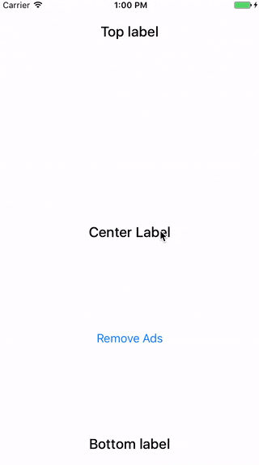

# AKGADWrapper


`AKGADWrapper` is a wrapper for a `UIViewController` with a `GADBannerView` at the bottom which automatically handles autolayout of the wrapped `UIViewController`. This is a very common task I stumbled upon during the development of apps that are displaying an AdMob banner.



## Installation

#### Manually and Swift
As this class uses AdMob as the external dependency, there is no way to use it while specifying `use_frameworks!`, because currently, AdMob is the static library itself.

In order to use this class you just need to copy `AKGADWrapperVC.h` and `AKGADWrapperVC.m` files and install [SAMKeychain](https://cocoapods.org/pods/SAMKeychain) and [Google-Mobile-Ads-SDK](https://cocoapods.org/pods/Google-Mobile-Ads-SDK) libraries as dependencies or connect them manually.

#### CocoaPods: Objective-C Only
Add the following line to your Podfile.

```
pod "AKGADWrapper", "~> 1.1.0"
```

Execute `pod install`.

## Usage

#### Example of Wrapping `rootViewController`
```objective-c
- (BOOL)application:(UIApplication *)application didFinishLaunchingWithOptions:(NSDictionary *)launchOptions
{
	//Instantiate a UIViewController to wrap
	UIViewController *mainVC = [[UIStoryboard storyboardWithName:@"Main" bundle:nil] instantiateInitialViewController];
	//Instantiate a AKGADWrapperVC with UIViewController to wrap and your Ad Unit ID 
	AKGADWrapperVC *wrappedVC = [[AKGADWrapperVC alloc] initWithViewController:mainVC adUnitID:@"ca-app-pub-3940256099942544/2934735716"];
	//Optionally set targeting options
	wrappedVC.gender = GADBaseGenderMale;
	//Set as the rootViewController
	self.window.rootViewController = wrappedVC;

	/// Set the color under the banner for the frameless devices
    wrappedVC.view.backgroundColor = [UIColor redColor];
   
	return YES;
}
```

#### Removing Ads
To hide Ads call `removeAds:` with `true` for disabling them forever or `false` to hide the currently presented banner but present it again after the app relaunch.
```objective-c
[wrapper removeAds:false];
```

#### Delaying Ads Presentation
In order to improve retention during the first app usage sessions, there is `showAdsAfter` feature which helps you to set a delay for presenting ads only after some amount of application launches. To start presenting Ads only on the 3rd launch set this property to `2` before presenting `AKGADWrapperVC` instance.
```objective-c
wrapper.showAdsAfter = 2;
```

## License (MIT)

Copyright (c) 2016 Oleksandr Kirichenko

Permission is hereby granted, free of charge, to any person obtaining a copy
of this software and associated documentation files (the "Software"), to deal
in the Software without restriction, including without limitation the rights
to use, copy, modify, merge, publish, distribute, sublicense, and/or sell
copies of the Software, and to permit persons to whom the Software is
furnished to do so, subject to the following conditions:

The above copyright notice and this permission notice shall be included in all
copies or substantial portions of the Software.

THE SOFTWARE IS PROVIDED "AS IS", WITHOUT WARRANTY OF ANY KIND, EXPRESS OR
IMPLIED, INCLUDING BUT NOT LIMITED TO THE WARRANTIES OF MERCHANTABILITY,
FITNESS FOR A PARTICULAR PURPOSE AND NONINFRINGEMENT. IN NO EVENT SHALL THE
AUTHORS OR COPYRIGHT HOLDERS BE LIABLE FOR ANY CLAIM, DAMAGES OR OTHER
LIABILITY, WHETHER IN AN ACTION OF CONTRACT, TORT OR OTHERWISE, ARISING FROM,
OUT OF OR IN CONNECTION WITH THE SOFTWARE OR THE USE OR OTHER DEALINGS IN THE
SOFTWARE.
